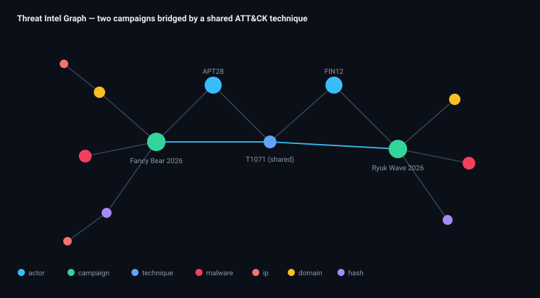
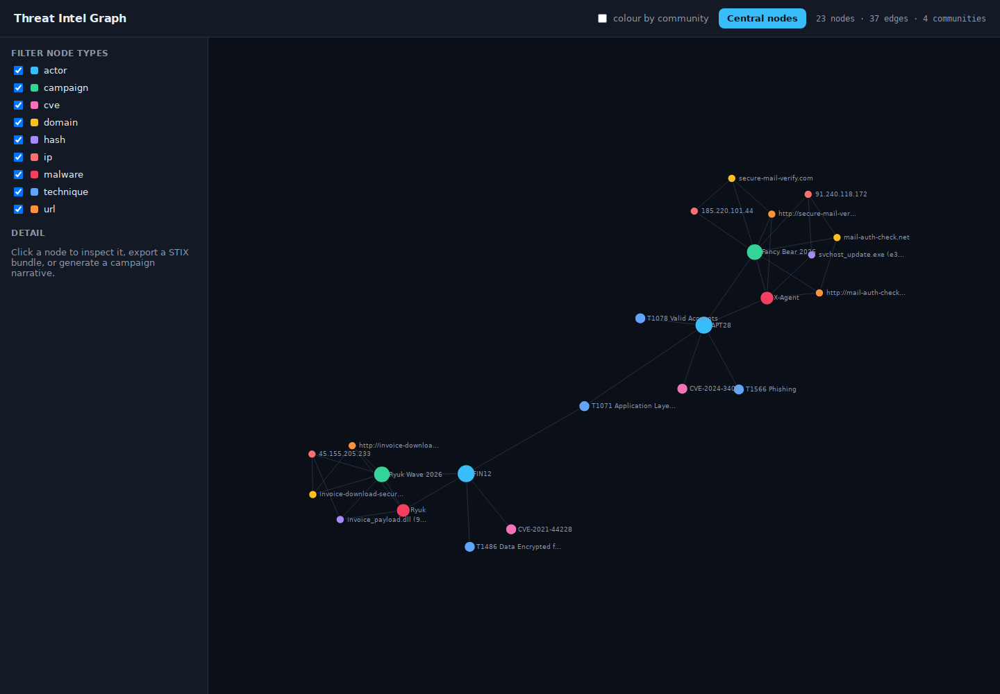

# Threat Intel Graph

**Turn isolated indicators of compromise into a graph of relationships that reveals
campaigns and threat actors** — collected from public feeds, stored in a
STIX-2.1-compatible property graph, analysed with PageRank and community
detection, exported to STIX, narrated by an LLM, and explored in an interactive
D3.js force graph.

<p align="center">
  
</p>

[](https://github.com/Vincent-P-essy/threat-intel-graph/actions/workflows/ci.yml)


---

## Dashboard Preview



D3 explorer populated from the project’s offline sample feeds.

## The idea

A CTI analyst rarely gets a clean answer from a flat table of indicators. The
value is in the *edges*: this IP `RESOLVES_TO` that domain, which is `USED_BY`
this actor, who `EXPLOITS` that CVE. Model those relationships as a graph and
questions that are painful in SQL become one traversal:

> *"Show me everything attributed to APT28, and which of our tracked CVEs they exploit."*

Threat Intel Graph ingests IOCs from four public-style sources into a property
graph, then lets you **rank the most central nodes** (infrastructure hubs and
actors), **cluster the graph into campaigns**, **export any subgraph as a STIX
2.1 bundle**, and **generate a narrative report** of a selected campaign.

---

## Highlights

| Capability | Detail |
|---|---|
| **4 IOC collectors** | AlienVault OTX, URLhaus, VirusTotal and MITRE ATT&CK, behind one `Collector` interface. Ship with offline sample pulls so everything runs without API keys. |
| **STIX-2.1 property graph** | Nodes (`ipv4-addr`, `domain-name`, `url`, `file`, `vulnerability`, `intrusion-set`, `campaign`, `attack-pattern`, `malware`) and typed edges (`resolves-to`, `hosted-on`, `communicates-with`, `uses`, `exploits`, `attributed-to`, `indicates`). |
| **Pluggable storage** | In-memory NetworkX graph by default (zero setup); a Neo4j adapter behind the same interface for production, driven by Cypher. |
| **Graph analytics** | PageRank to surface central actors/infrastructure; greedy-modularity community detection to cluster campaigns. |
| **Predefined intel queries** | *"all IOCs linked to actor X"*, *"campaigns exploiting CVE-Y"*, *n-hop neighbourhood of any node*. |
| **STIX 2.1 export** | Any node's neighbourhood → a valid STIX bundle with SDOs and SROs. |
| **LLM narrative** | A selected subgraph → a natural-language campaign report (Anthropic Claude, with a deterministic template fallback so it runs offline). |
| **D3.js explorer** | Force-directed graph: filter by node type, expand a node, colour by community, one-click STIX export and narrative. |

---

## Quick start

```bash
git clone https://github.com/Vincent-P-essy/threat-intel-graph
cd threat-intel-graph
python -m venv .venv && source .venv/bin/activate
pip install -r requirements.txt

python -m tig.ingest            # load the offline sample feeds into the graph
uvicorn tig.api:app --reload    # http://localhost:8000
```

Open <http://localhost:8000> and explore. No Neo4j, no API keys, no LLM key
required — the in-memory graph and template narrator run entirely offline.

### Docker

```bash
docker compose up --build       # api + neo4j
```

---

## API

| Method & path | Purpose |
|---|---|
| `GET /api/graph` | Full graph as `{nodes, links}` for D3 (supports `?type=` and `?limit=` filters) |
| `GET /api/node/{id}` | A node plus its n-hop neighbourhood (`?depth=`) |
| `GET /api/actor/{name}/iocs` | Every indicator attributed to an actor |
| `GET /api/cve/{id}/campaigns` | Campaigns exploiting a CVE |
| `GET /api/analysis/central` | Top nodes by PageRank |
| `GET /api/analysis/communities` | Detected communities (campaign clusters) |
| `GET /api/stix/{id}` | STIX 2.1 bundle for a node's neighbourhood |
| `GET /api/narrative/{id}` | Natural-language report for a node's campaign subgraph |
| `GET /healthz` | Store backend + node/edge counts |

Example:

```bash
curl localhost:8000/api/actor/APT28/iocs | jq
curl localhost:8000/api/analysis/central | jq '.[0:3]'
curl localhost:8000/api/narrative/campaign--fancy-bear-2026 | jq -r .narrative
```

---

## Architecture

```
IOC collectors (OTX · URLhaus · VirusTotal · MITRE)  ── offline sample pulls
        │  normalise to STIX-shaped observations
        ▼
GraphStore  ── NetworkX (default) | Neo4j (Cypher) behind one interface
        │
        ├── analysis   → PageRank (central nodes), community detection (campaigns)
        ├── stix       → STIX 2.1 bundle export
        └── narrative  → LLM report (Claude) | deterministic template
        ▼
FastAPI  ──  /api/graph, /api/analysis/*, /api/stix, /api/narrative
        ▼
D3.js force-graph explorer
```

See [`docs/ARCHITECTURE.md`](docs/ARCHITECTURE.md) for the data model, why a graph
beats tables for CTI, and the storage-abstraction contract.

---

## Configuration

| Variable | Default | Purpose |
|---|---|---|
| `NEO4J_URI` | *(unset)* | Use Neo4j when set (e.g. `bolt://localhost:7687`); NetworkX otherwise |
| `NEO4J_USER` / `NEO4J_PASSWORD` | `neo4j` / `neo4j` | Neo4j credentials |
| `ANTHROPIC_API_KEY` | *(unset)* | Enables the Claude narrator; template fallback otherwise |
| `TIG_MODEL` | `claude-opus-4-8` | Model id for the narrator |

---

## Testing

```bash
pytest                 # unit + API + analysis + STIX validity
ruff check tig tests
```

---

## License

MIT © Vincent Plessy
